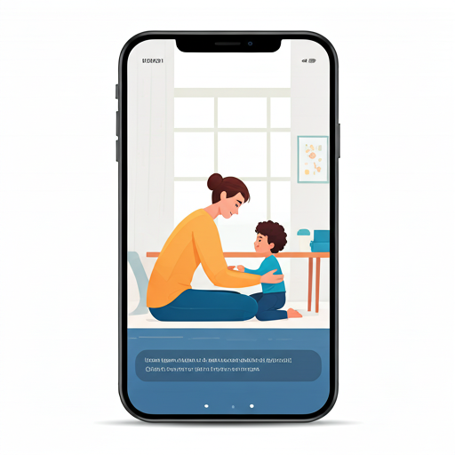

# AuthCares

<p align="center">
  
</p>

<h3 align="center">Monitoreo inteligente para acompañar a niños con TEA en tiempo real</h3>

<p align="center">
  
  
  
  
</p>

---

## Descripción

**AuthCares** es una solución móvil orientada al acompañamiento de niños con Trastorno del Espectro Autista (TEA), diseñada para apoyar a padres y cuidadores mediante monitoreo inteligente, historial de salud, alertas, estadísticas y asistencia con IA.

El proyecto integra una aplicación Android desarrollada con **Kotlin**, **Jetpack Compose** y arquitectura **MVVM**, conectada con **Firebase** y preparada para recibir información de sensores desde un **Galaxy Watch**.

---

## Problema

Los padres y cuidadores de niños con TEA muchas veces necesitan estar atentos a cambios físicos o conductuales durante el día, incluso cuando el niño se encuentra en el colegio, en terapia o lejos de casa.

Sin una herramienta centralizada, es difícil:

- Conocer el estado del niño en tiempo real.
- Revisar historial de mediciones.
- Detectar situaciones que requieren atención.
- Compartir información clara con especialistas o familiares.
- Tomar decisiones rápidas con base en datos confiables.

---

## Solución

AuthCares propone una plataforma de monitoreo que conecta un **Galaxy Watch** con una aplicación móvil para padres y cuidadores.

El reloj registra información del niño, como ritmo cardíaco y movimiento. Luego, esos datos se envían a Firebase y la app móvil los presenta de forma clara mediante:

- Panel principal de seguimiento.
- Alertas basadas en datos reales.
- Estadísticas por periodo.
- Historial de mediciones.
- Resúmenes para compartir.
- Asistente con IA para consultas y orientación.

La aplicación no reemplaza la evaluación médica o profesional, pero ayuda a visualizar información importante y facilita el acompañamiento diario.

---

## Arquitectura

```text
┌────────────────────┐
│    Galaxy Watch    │
│  Wear OS Sensors   │
└─────────┬──────────┘
          │
          ▼
┌────────────────────────────┐
│ Firebase Realtime Database │
│ latest / history           │
└─────────┬──────────────────┘
          │
          ▼
┌────────────────────┐
│  Aplicación móvil  │
│ Android + Compose  │
└─────────┬──────────┘
          │
          ▼
┌────────────────────┐
│  Aplicación web    │
│ Panel complementario│
└────────────────────┘
```

### Servicios de Firebase utilizados

| Servicio | Rol dentro de AuthCares |
|---|---|
| **Firebase Authentication** | Permite el inicio de sesión seguro de padres o cuidadores. |
| **Firebase Firestore** | Guarda información principal de usuarios, niños registrados y relación con el reloj vinculado. |
| **Firebase Realtime Database** | Recibe y actualiza datos del reloj en tiempo real, incluyendo medición actual e historial. |
| **Firebase Cloud Messaging** | Permite recibir notificaciones importantes incluso si la app no está abierta. |

---

## Características principales

✅ **Monitoreo en tiempo real**  
Visualización del estado actual del niño a partir de datos recibidos desde el reloj.

✅ **Dashboard principal**  
Pantalla central con información clara para padres y cuidadores.

✅ **Alertas inteligentes**  
Detección de situaciones relevantes usando datos reales del historial del reloj.

✅ **Notificaciones críticas**  
Integración con Firebase Cloud Messaging para alertas importantes.

✅ **Historial de mediciones**  
Lectura de registros guardados para analizar el comportamiento durante el tiempo.

✅ **Estadísticas reales**  
Cálculo de promedio, máximo, mínimo, cantidad de mediciones y actividad por periodo.

✅ **Compartir resumen**  
Generación de resumen del periodo seleccionado para enviarlo por aplicaciones instaladas.

✅ **Asistente con IA**  
Uso de Gemini API para ofrecer apoyo contextual dentro de la aplicación.

✅ **Integración con Galaxy Watch**  
Preparado para trabajar con dispositivos Wear OS como Galaxy Watch 5 y Galaxy Watch 8.

---

## Tecnologías utilizadas

| Categoría | Tecnología |
|---|---|
| Lenguaje principal | Kotlin |
| Interfaz móvil | Jetpack Compose |
| Arquitectura | MVVM |
| Autenticación | Firebase Authentication |
| Base de datos principal | Firebase Firestore |
| Datos en tiempo real | Firebase Realtime Database |
| Notificaciones | Firebase Cloud Messaging |
| Inteligencia artificial | Gemini API |
| Wearable | Wear OS / Galaxy Watch |
| IDE | Android Studio |
| Gestión del proyecto | Gradle |

---

## Capturas de pantalla

> Reemplazar los espacios siguientes con capturas reales del proyecto.

### Login

| Pantalla de inicio de sesión |
|---|
| `assets/screenshots/login.png` |

### Dashboard

| Panel principal |
|---|
| `assets/screenshots/dashboard.png` |

### Estadísticas

| Estadísticas en tiempo real |
|---|
| `assets/screenshots/estadisticas.png` |

### Asistente IA

| Asistente inteligente |
|---|
| `assets/screenshots/ia.png` |

### Conexión del reloj

| Vinculación con Galaxy Watch |
|---|
| `assets/screenshots/conexion-reloj.png` |

### Aplicación web

| Panel web complementario |
|---|
| `assets/screenshots/web.png` |

---

## Video demostración

📹 **Demo del proyecto:**  
`Agregar aquí el enlace del video demostrativo`

Ejemplo:

```text
https://youtu.be/tu-video-demo
```

---

## Instalación

### Requisitos previos

- Android Studio instalado.
- JDK compatible con Android Studio.
- Cuenta de Firebase.
- Proyecto Firebase configurado.
- Dispositivo Android o emulador.
- Galaxy Watch compatible para pruebas con Wear OS.

### Pasos para ejecutar

1. Clonar el repositorio:

```bash
git clone https://github.com/KvrlvP/AuthCares2.git
```

2. Abrir el proyecto en Android Studio.

3. Agregar el archivo de configuración de Firebase:

```text
app/google-services.json
```

4. Sincronizar Gradle desde Android Studio.

5. Ejecutar la aplicación en un dispositivo o emulador Android.

6. Iniciar sesión con una cuenta registrada y vincular un reloj disponible.

---

## Estructura del proyecto

```text
app/src/main/java/com/choque/authcares2
│
├── app
│   └── Contiene la entrada principal de la aplicación móvil.
│
├── core
│   └── Modelos compartidos usados por diferentes pantallas.
│
├── features
│   ├── alerts
│   │   └── Alertas, notificaciones y lectura de situaciones desde el historial.
│   │
│   ├── assistant
│   │   └── Asistente con IA y construcción de respuestas.
│   │
│   ├── auth
│   │   └── Inicio de sesión y validación de usuario.
│   │
│   ├── home
│   │   └── Pantalla principal y listado de niños.
│   │
│   ├── monitoring
│   │   └── Lectura del estado actual del reloj conectado.
│   │
│   ├── profile
│   │   └── Perfil del usuario y detalle del niño.
│   │
│   ├── settings
│   │   └── Configuración de alertas y vinculación del reloj.
│   │
│   ├── share
│   │   └── Pantallas relacionadas con compartir información.
│   │
│   └── stats
│       └── Estadísticas, historial y resumen de datos reales.
│
├── navigation
│   └── Rutas y flujo de pantallas.
│
└── ui
    └── Componentes reutilizables y tema visual.
```

---

## Integrantes

| Nombre | Rol | Responsabilidad |
|---|---|---|
| Karla Choque | Desarrolladora Android | Desarrollo de la aplicación móvil, integración con Firebase, diseño de la interfaz y arquitectura del sistema. |
| Ayelen Soto | Desarrolladora de integración IoT | Desarrollo del sistema del smartwatch, configuración de sensores y transmisión de datos hacia la aplicación móvil. |
| Willy Torres | Desarrollador backend y base de datos | Apoyo en la estructura de Firebase, almacenamiento de datos, validación de registros y pruebas de comunicación entre los dispositivos. |
| Johs Cori | Desarrollador y responsable de pruebas | Apoyo en la implementación de funcionalidades, pruebas del sistema, identificación de errores y documentación técnica del proyecto. |

---

## Futuras mejoras

- 📍 **GPS en tiempo real** para conocer ubicación segura del niño.
- 🔋 **Monitoreo de batería del reloj** para evitar pérdida de seguimiento.
- 🌡️ **Temperatura corporal** como señal adicional de monitoreo.
- 📄 **Reportes PDF** para compartir con especialistas o instituciones.
- 🧠 **IA contextual** con análisis más personalizado según historial y patrones.
- 🌐 **Panel web avanzado** para seguimiento desde escritorio.
- 📊 **Comparativas por semana y mes** con visualizaciones más completas.

---

## Estado del proyecto

AuthCares se encuentra en desarrollo como proyecto universitario, con enfoque en:

- Monitoreo móvil.
- Integración con Firebase.
- Visualización de datos reales.
- Alertas inteligentes.
- Experiencia de usuario accesible para padres y cuidadores.

---

## Aviso importante

AuthCares es una herramienta de apoyo y monitoreo. No reemplaza el diagnóstico, seguimiento o tratamiento realizado por profesionales de salud, psicología o educación especializada.

---

<p align="center">
  Hecho con Kotlin, Firebase y mucho propósito.
</p>
